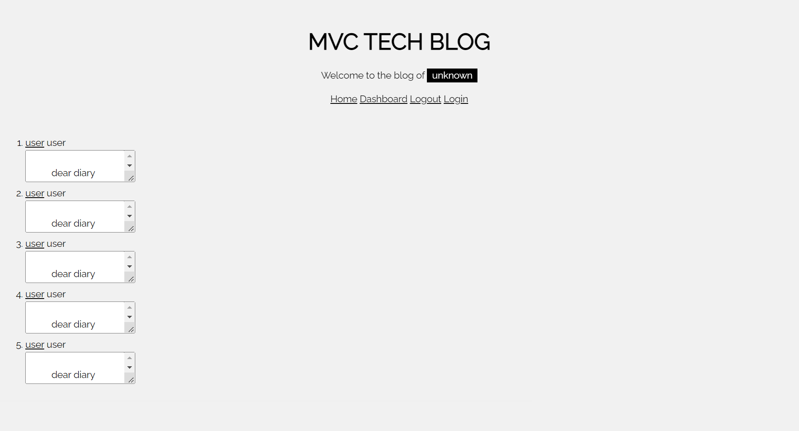

# MVC Tech BLog

## Deployable Video Link


## Goal
The task was to make a MVC Tech blog using backend development.

## Technology Use
  - Javascript
  - Node.js
  - Handlebars
  - Mysql2
  - Express
  - Express-Handlebar
  - VS Code
  - Git Bash 
  - GitHub

## Execution
The first part of making the tech blog was to make a setup schema.sql, seeds.sql, index.js and gitignore files. After downloading the right versions of express, handlebars, , the tricky part was to make functions that would work with MySQL in order to generate the blog. The following is the schema used to make the table.

schema.sql code:
```SQL
DROP DATABASE IF EXISTS techblog_db;
CREATE DATABASE techblog_db;

```
After inputting the following sql file into the MySQL system, the next step was to makes seeds.js files, model.js files, handlebar files, index.js files for each section. the models looked like the ones below:
```Javascript
const { Model, DataTypes } = require('sequelize');

const sequelize = require('../config/connection');

class Blog extends Model {}

Blog.init(
  {
    // define columns
    id: {
      type: DataTypes.INTEGER,
      allowNull: false,
      primaryKey: true,
      autoIncrement: true,
    },
    blog_name: {
      type: DataTypes.STRING,
      allowNull: false
    },
    blog: {
      type: DataTypes.STRING,
      allowNull: false
    },
    user_id: {
      type: DataTypes.INTEGER,
      references: {
        model: "user",
        key: "id"
      }
    }
  },
  {
    sequelize,
    timestamps: true,
    freezeTableName: true,
    underscored: true,
    modelName: 'blog',
  }
);

module.exports = Blog;
```
```Javascript
const { Model, DataTypes } = require('sequelize');
// 
const sequelize = require('../config/connection');

// 
class Post extends Model {}

// 
Post.init(
  {
    // define columns
    id: {
      type: DataTypes.INTEGER,
      allowNull: false,
      primaryKey: true,
      autoIncrement: true,
    },
    post: {
      type: DataTypes.STRING,
      allowNull: false
    },
    user_id: {
      type: DataTypes.INTEGER,
      references: {
        model: "user",
        key: "id"
      }
    },
    blog_id: {
      type: DataTypes.INTEGER,
      references: {
        model: "blog",
        key: "id"
      }
    }
  },
  {
    sequelize,
    timestamps: true,
    freezeTableName: true,
    underscored: true,
    modelName: 'post',
  }
);

module.exports = Post;
```
After making the models, routes that routed the information to other files and to function like pressing a button that sends the user to the other page and storing user input to the backend server. An easy analogy is routes act a lot like highways to cities. They have to go somewhere.

The last part of making the tech blog was making handlebars connect to everything.
## Result

The following website demonstrates what the final product looks like:



<!-- ## Acceptance Criteria

```md
GIVEN a CMS-style blog site

WHEN I visit the site for the first time
THEN I am presented with the homepage, which includes existing blog posts if any have been posted; navigation links for the homepage and the dashboard; and the option to log in

WHEN I click on the homepage option
THEN I am taken to the homepage

WHEN I click on any other links in the navigation
THEN I am prompted to either sign up or sign in

WHEN I choose to sign up
THEN I am prompted to create a username and password

WHEN I click on the sign-up button
THEN my user credentials are saved and I am logged into the site

WHEN I revisit the site at a later time and choose to sign in
THEN I am prompted to enter my username and password

WHEN I am signed in to the site
THEN I see navigation links for the homepage, the dashboard, and the option to log out

WHEN I click on the homepage option in the navigation
THEN I am taken to the homepage and presented with existing blog posts that include the post title and the date created

WHEN I click on an existing blog post
THEN I am presented with the post title, contents, post creator’s username, and date created for that post and have the option to leave a comment

WHEN I enter a comment and click on the submit button while signed in
THEN the comment is saved and the post is updated to display the comment, the comment creator’s username, and the date created

WHEN I click on the dashboard option in the navigation
THEN I am taken to the dashboard and presented with any blog posts I have already created and the option to add a new blog post

WHEN I click on the button to add a new blog post
THEN I am prompted to enter both a title and contents for my blog post

WHEN I click on the button to create a new blog post
THEN the title and contents of my post are saved and I am taken back to an updated dashboard with my new blog post

WHEN I click on one of my existing posts in the dashboard
THEN I am able to delete or update my post and taken back to an updated dashboard

WHEN I click on the logout option in the navigation
THEN I am signed out of the site

WHEN I am idle on the page for more than a set time
THEN I am automatically signed out of the site 
``` -->